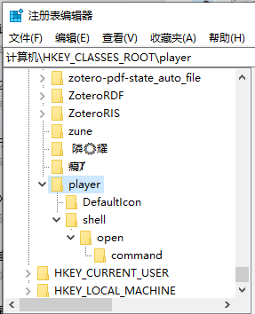

[基于URL协议实现视频时间戳](cl://20230428182624/def)
# 简介
当前标准markdown语法中的视频链接只能打开本地视频，但不能定位到视频中的特定时间戳，部分markdown编辑器实现了时间戳语法但不通用。针对此问题，本项目实现一个自定义URL协议。访问基于此协议编写的本地视频链接时将调用自定义URL协议，用指定播放器打开指定视频并跳转到指定时间戳。效果演示如下：

# 实现
本项目基于[自定义URL协议](cl://20230429163000/use)，所以也是分为注册协议和编写程序两个部分，最后再加上一个应用验证。
## 注册协议
* 打开注册表编辑器
* 在`计算机\HKEY_CLASSES_ROOT`下建立如下的注册表结构（因为要实现视频播放，所以就是一个player，因此这个自定义协议的title也叫player）：
  
* 在player项下新建字符串值URL Protocol，值是空字符串：
  
* 把DefaultIcon项下的默认值改为要调用的语言引擎路径。我们是基于python实现，所以这里写python解释器的路径：
  
* 把command项下的默认值改为`D:\ProgramFiles\anaconda3\python.exe C:\Users\xuyang\Desktop\a.py %1`：
  
* 至此协议就注册完毕，以后访问“player://E:/a.mp4#12:9”这样的URL时，就会在命令行运行`D:\ProgramFiles\anaconda3\python.exe D:\ProgramFiles\playerProtocol\playerProtocol.py %1`这样的指令。

## 编写程序
* 创建python程序`D:\ProgramFiles\playerProtocol\playerProtocol.py。
* 程序内容[参见](https://github.com/Zhuo-Ren/VideoTimestampProtocol/blob/main/playerProtocol.py)。

# 应用验证
效果演示就如前文“简介”所示。这里再加一个实例验证(因为项目是针对本地视频链接，所以放在github上应该就用不了了，这里就是一个示意)： [1](player://E:\resource\document\1科目：COMPUTER\4科目：人工智能\1：教程和书籍\RNN,LSTM，梯度问题-1.mp4#9:45)。
